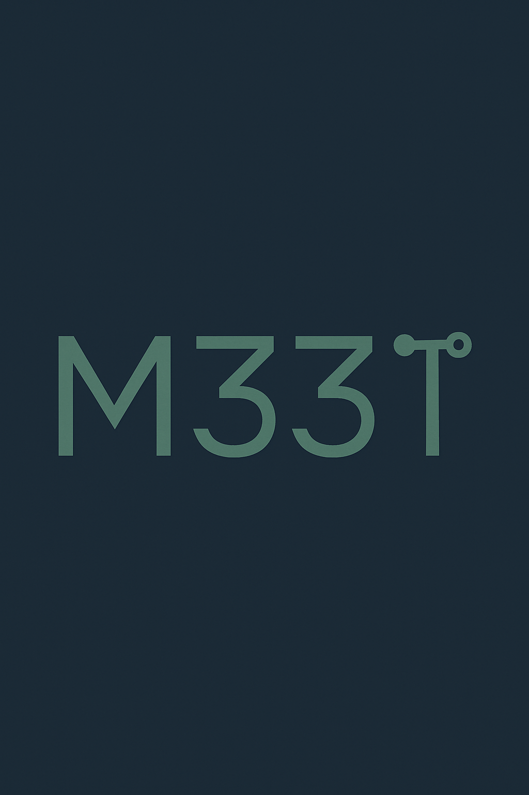

# meet-platform-icp

## Meet is a platform developed for icp hackaton.

## Overview

M33T is a decentralized event platform designed to redefine how people create, access, and engage with events in the Web3 era. It leverages blockchain to provide token-gated access, seamless wallet integrations, and community-driven ownership of experiences. The platform ensures transparency, trust, and verifiable participation, while empowering organizers and attendees alike.

## The Problem

Traditional event platforms rely heavily on centralized intermediaries, high fees, and limited transparency. Organizers face issues like fake tickets, bots, and resale abuse, while attendees lack true ownership over their participation and rewards. Communities need a borderless, secure, and trustless solution that reflects the values of Web3.

## The Solution

M33T provides a fully decentralized event hub where:

Organizers create events with smart contract–powered ticketing that eliminates fraud.

Communities use NFTs, tokens, or DAOs to grant tiered or exclusive access.

Attendees gain verifiable proof-of-attendance (POAPs), collectibles, and in-platform rewards.

Liquidity and token swaps are frictionless thanks to LI.FI SDK and Meteora’s DammV2 pools.

Key Features

Token-Gated Access: Entry and perks tied to NFTs, DAO memberships, or fungible tokens.

Wallet Integration: Support for Circle Wallet, Phantom, and popular multi-chain wallets.

Cross-Chain Liquidity: Smooth token swaps to remove onboarding barriers.

Organizer Dashboard: Tools to design event pages, distribute rewards, and track engagement.

Gamification & Rewards: XP, airdrops, and digital collectibles to boost retention.

Community Ownership: Governance features allow DAOs or collectives to co-manage events.

## Why ICP?

The Internet Computer offers the ideal infrastructure to scale M33T:

Scalability & Speed: Low-latency smart contracts that support high-volume ticketing.

Affordable & Sustainable: Low transaction costs, enabling mass adoption.

End-to-End On-Chain: Events, ticketing, storage, and logic can run natively on ICP canisters, minimizing reliance on Web2 services.

Seamless UX: Fast, secure transactions that feel like Web2 but are fully decentralized.

## Impact & Vision

M33T aims to become the go-to hub for Web3 events, from exclusive DAO councils to global conferences and music festivals. The platform empowers communities to:

Build borderless connections without intermediaries.

Foster trust and transparency in how events are organized.

Enable new economies, where tickets, rewards, and collectibles retain value beyond the event itself.

## Roadmap

MVP: Token-gated event creation + wallet login + basic ticketing.

Phase 2: Proof-of-attendance NFTs, community airdrops, and gamified engagement.

Phase 3: DAO governance tools, reputation systems, and cross-ecosystem partnerships.

Long Term: Become the Web3 standard for digital & physical event infrastructure.

## Architecture

M33T is designed as a modular three-layer architecture:

Frontend Layer (User Experience):

Built with Next.js + TailwindCSS for a responsive and modern interface.

Wallet connection and transaction handling via Web3.js / ICP agent SDK.

Dynamic event pages, token-gated entry validation, and real-time updates.

Application Layer (Smart Contracts & Logic):

Event creation, ticket issuance, and POAPs run on ICP canisters (smart contracts).

Anchor framework (Solana) integration for token logic and staking pools.

DAO-based governance using SNS (Service Nervous System) modules on ICP.

Infrastructure Layer (Storage & Data):

Event metadata, images, and files stored via ICP canister storage or IPFS for decentralization.

Transaction data indexed in ClickHouse or Postgres for analytics dashboards.

## Tech Stack

Frontend: Next.js 14, TailwindCSS, React Context for state, ICP Agent JS SDK.

Smart Contracts: ICP Canisters (Motoko/Rust), Anchor (Solana) for tokenomics.

Wallets: Circle Wallet, Phantom, MetaMask (via multi-chain bridging).

Liquidity: LI.FI SDK, Meteora DammV2 pools.

Database/Analytics: ClickHouse (real-time queries), PostgreSQL (relational ops).

File Storage: IPFS + ICP canisters for event data, optional AWS S3 for hybrid.

Deployment: Dockerized microservices + ICP canisters for scaling.